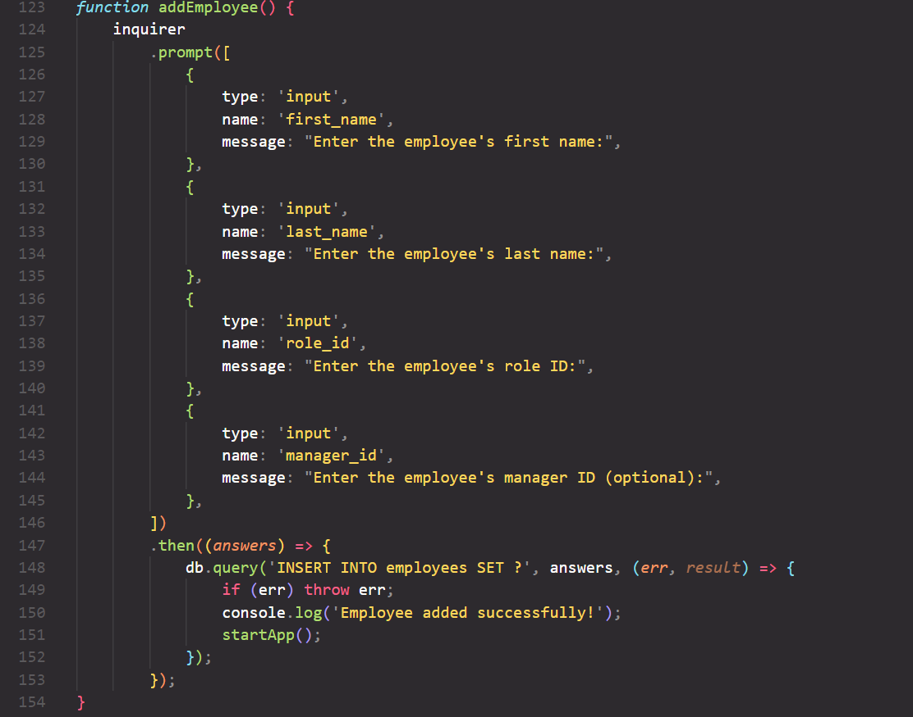
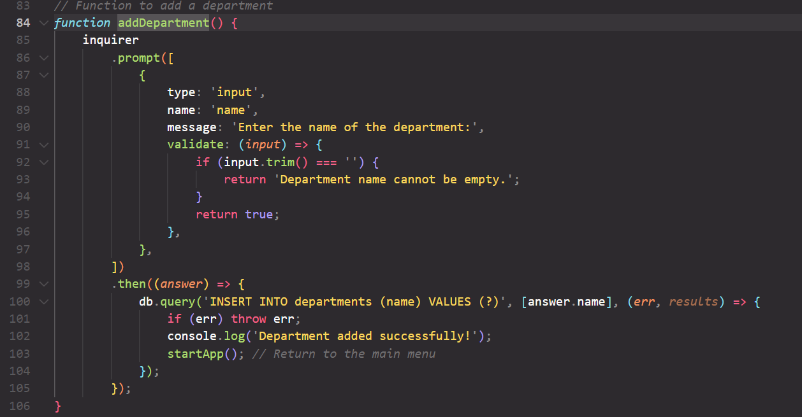

# challenge-12

## Github Repo

- https://github.com/Miekooooo/challenge-12

## Video Link

- 

## Instructions
1. Run your "schema.sql" file
2. Run your "app.js" with node
3. Pick what action you wanna complete using your arrow keys

## Description
- A employee manager that is ran in your console using Inquirer and SQL. 

- "what was my motivation?" - To understand Inquirer better by the end.
- "why did I build this project?" - To better understand Inquirer and SQL.
- "what problem does it solve?" - It gives a employeer a easy to use and run employee manangement system.
- "what did I learn?" - How to create a Inquirer console application.

## Features

- Ability to view roles, employees, etc.
- Ability to change roles, employees, etc.

## Screenshots

- 
- 
- 

## Installation

- No installation 

## Usage

- Could be used in a small workplace, such as a smaller family owned business; being that a console app would begin to get confusing the more it was expanded possibly.

## Credits

- Google.com 

## License 

MIT License

Copyright (c) [2023] [Locket Layne]

Permission is hereby granted, free of charge, to any person obtaining a copy
of this software and associated documentation files (the "Software"), to deal
in the Software without restriction, including without limitation the rights
to use, copy, modify, merge, publish, distribute, sublicense, and/or sell
copies of the Software, and to permit persons to whom the Software is
furnished to do so, subject to the following conditions:

The above copyright notice and this permission notice shall be included in all
copies or substantial portions of the Software.

THE SOFTWARE IS PROVIDED "AS IS", WITHOUT WARRANTY OF ANY KIND, EXPRESS OR
IMPLIED, INCLUDING BUT NOT LIMITED TO THE WARRANTIES OF MERCHANTABILITY,
FITNESS FOR A PARTICULAR PURPOSE AND NONINFRINGEMENT. IN NO EVENT SHALL THE
AUTHORS OR COPYRIGHT HOLDERS BE LIABLE FOR ANY CLAIM, DAMAGES OR OTHER
LIABILITY, WHETHER IN AN ACTION OF CONTRACT, TORT OR OTHERWISE, ARISING FROM,
OUT OF OR IN CONNECTION WITH THE SOFTWARE OR THE USE OR OTHER DEALINGS IN THE
SOFTWARE.